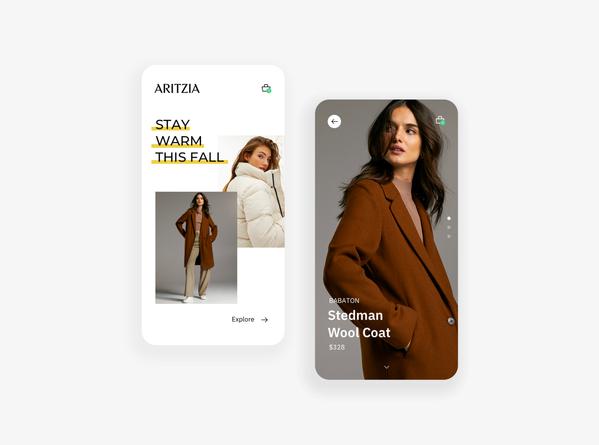

# warm_coat_ui

A new Flutter ui app. based on this design 

this is a test app. all images come from 

# Note:
1. 这个APP，关键在于使用Stack, 以及字体修饰，还有Painter
2. 

# todo 

1. Painter 这部分我确实是不熟悉。熟悉之后再搞。home_screen, line 86
2. 竖直方向的tabView 怎么写呢？？